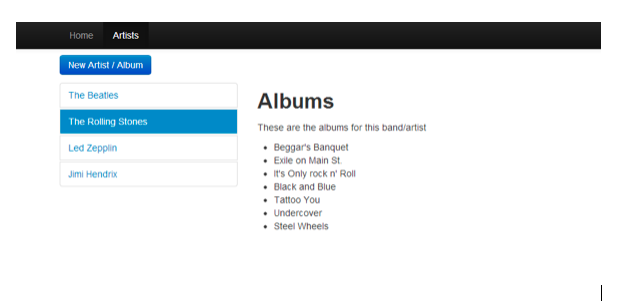
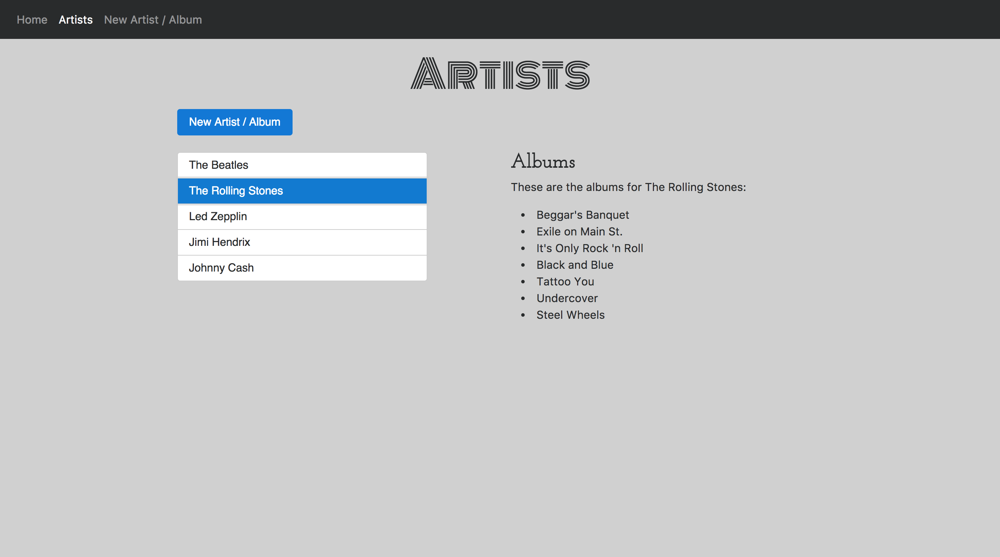

# Software Development Exercise
---

### Exercise Overview
The goal of this exercise is to build a simple web application that allows a user to browse and manage a database of artist and related album information.

### Methodology
This exercise is designed to test the candidate’s development workflow and skill level at various aspects of the overall solution. It is intended that the candidate ask questions, use internet resources, and ask for general guidance from company personnel during the exercise as needed. The instructions are purposefully minimal to allow the candidate to use discretion about how the solution should be completed.

### Development Guidelines
The following technologies should be used but alternates can be considered too. 

  1. SQL Server

  2. ASP.Net WebForms or ASP.Net MVC

  3. Visual Studio

Additional libraries may be used at the discretion of the candidate.

### Database Design
Using the screenshot in the screen mockups section, design and implement a simple database to hold the information needed to display artist and album information as shown.

### UI Design
The design in the screenshot (layout, colors, etc.) can be implemented as shown or the candidate can improve the design as they see appropriate. 

The only requirements for the design are as follows:

  1. Must demonstrate a table-less design on the artist listing screen. Must use div’s to create the left and right panes of the layout as shown above.

### Screen Mockups

#### Screen Notes: Artist Listing Screen

  1. The artist listing screen should list the artist on the left and the albums for that artist on the right.

  2. Clicking the “New Artist / Album” button should take the user to a form where they can add a new artist, album or both at the same time.

  3. Clicking on an artist should show the albums for the artist to the right of the page. The selected artist name should be highlighted on selection.

### Requirements for Completion
The candidate’s application should accomplish the following to be considered functionally complete.

  1. Listing artists

  2. Clicking on an artist returns the albums for the artist

  3. Clicking the “New Artist / Album” button should present the user with a form to enter a new artist, album, or both and save the new entry.

---

# My Solution

